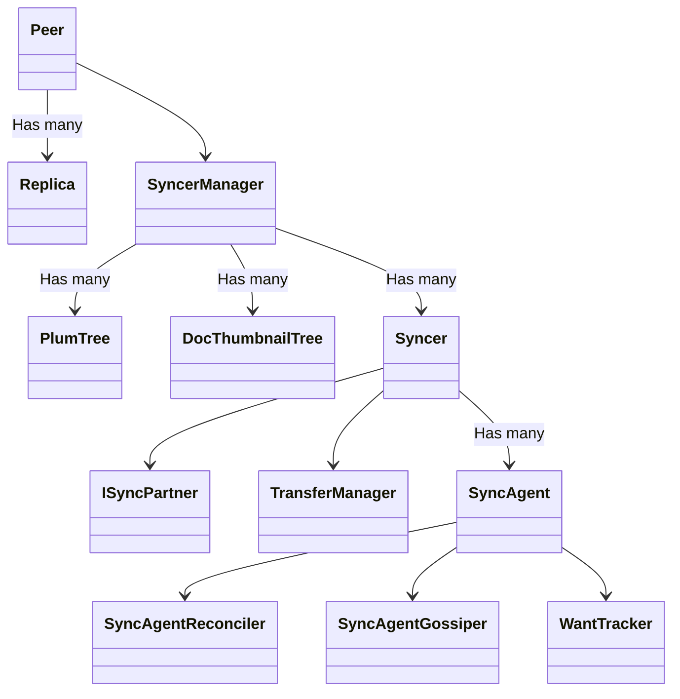

# Earthstar codebase architecture

This document aims to help people gain a high-level sense of how the codebase is
structured, and to answer the question 'where is the thing that does X?'.

At the highest level, this module exposes APIs to write and query data to local
databases, and sync them with remote databases.

Although Earthstar is conceptually simple, this module's codebase is complex.
The primary source of this complexity is this module's versatility:

- Support for multiple JavaScript runtimes (browsers, Deno, Node)
- Support for drivers which take advantage of these different platforms'
  capabilities:
  - Storage drivers for Replicas (e.g. Sqlite, IndexedDB)
  - Transport drivers for syncing (e.g. Local sync, HTTP)
  - Cryptographic library drivers (e.g. libsodium, noble-ed25519)
- Storage APIs which are capable of supporting multiple formats (es.4, es.5,
  future formats with new breaking features)

And the other culprit: decent synchronisation. Making synchronisation efficient,
resilient, and pleasant to use requires an inescapable amount of complexity.

## Replicas, drivers and formats

`Replica` is the API users will interact with most. It's really a tiny subclass
of `MultiformatReplica` which has been configured to use the `es.5` document
format by default, and provide some syntactic convenience.

Formats implement the 'rules' of Earthstar (i.e. validating incoming documents,
generating valid new ones). `FormatEs5` is the latest and greatest format,
bringing support for attachments and share keypairs.

`MultiformatReplica` is the biggest class in the codebase. It is responsible for
querying and writing data, and is able to read and write data of different
formats.

`MultiformatReplica`'s support for many formats means it has a lot of generic
typing in it. Follow the typingn pattern used by other methods and you should be
okay.

Every `Replica` is instantiated with a driver, like `ReplicaDriverWeb` or
`ReplicaDriverFs`. These drivers are made up of two sub-drivers, one for
documents and one for arbitrary binary data (attachments). Examples of these
include `DocDriverIndexedDB` and `AttachmentDriverFilesystem`. These sub-drivers
are where platform APIs are used to read and write data.

## Synchronisation, Peers and Partners

Synchronisation involves a large tree of classes:

- `Peer` sits at the root of this tree
  - Holding many `Replica`s
  - And a single `SyncerManager`
    - Which holds many `PlumTree` for each replica being synced globally (to be
      shared between `Syncer`s to assist in efficient gossiping)
    - Which holds many `DocThumbnailTree`, one for each replica being synced (to
      be used to generate fingerprints for range-based set reconciliation)
      globally (to be shared between `Syncer`s to assist with efficient
      reconciliation)
    - And which holds many `Syncer`, which coordinates sync with a single target
      peer
      - Which has a `ISyncPartner` implementing methods to communicate with the
        target peer (e.g. over Websockets)
      - A `TransferManager` to coordinate binary transfers with the target peer
        and track their completion - A `TransferQueue` to manage transfers
        queued execution
      - Many `SyncAgent` (one per share in common)
        - With one `SyncAgentReconciler` to perform initial reconcilition
        - With one `SyncAgentGossiper` to perform data gossiping
        - And one `WantTracker` to keep track of requested documents

As a diagram:

Earthstar uses
[range-based set reconciliation](https://github.com/AljoschaMeyer/master_thesis)
to make syncing more efficient. This is implemented in a separate module,
[range-reconcile](https://github.com/earthstar-project/range-reconcile).

## Cryptography

The `Crypto` class is used to create and verify ed25519 signatures and produce
SHA256 hashes.

Unfortunately ed25519 is not widely supported in the Web Crypto API, so it needs
to be provided for by us. Some implementations of ed25519 are magnitudes more
performant than others but only available on certain platforms, so we need
support for cryptography drivers.

Users will only need to interact with the `Crypto` class, preconfigured to use
the `GlobalCryptoDriver`.

There are many crypto drivers implementing the `ICrypto` interface, e.g.
`CryptoDriverSodium`, `CryptoDriverNoble`.

## Multi-platform support

Earthstar can be run in browsers, Deno, and Node, with different distributions
for each.

Deciding which modules belong to which distribution is done in `/src/entries`.

The entrypoint for the Deno module is `mod.ts`.

The entrypoint for the browser module is `mod.browser.ts`. This the entrypoint
for creating the web bundle, generated by `scripts/build_web_bundle.ts`.

The most complicated distribution by far is Node. It needs a lot of standard Web
APIs to be shimmed into it, and certain dependencies swapped out. This is done
in `scripts/build_npm.ts`.

Some files have their destination platform in their filename, e.g.
`src/replica/doc_drivers/sqlite.node.ts`.

## Tests

Tests are all stored in `src/tests`. The standard Deno testing API is used.
These tests are all re-used and run against Node for the NPM distribution, too.

Many tests use a homespun scenario system, where different scenarios are run
against the same test. These scenarios can be found in `src/test/scenarios`.

## Dependencies

External dependencies are all managed in `deps.ts`. When modules in this
codebase import dependencies, they do it through this file.

Node dependencies are managed in `scripts/build_npm.ts`.
