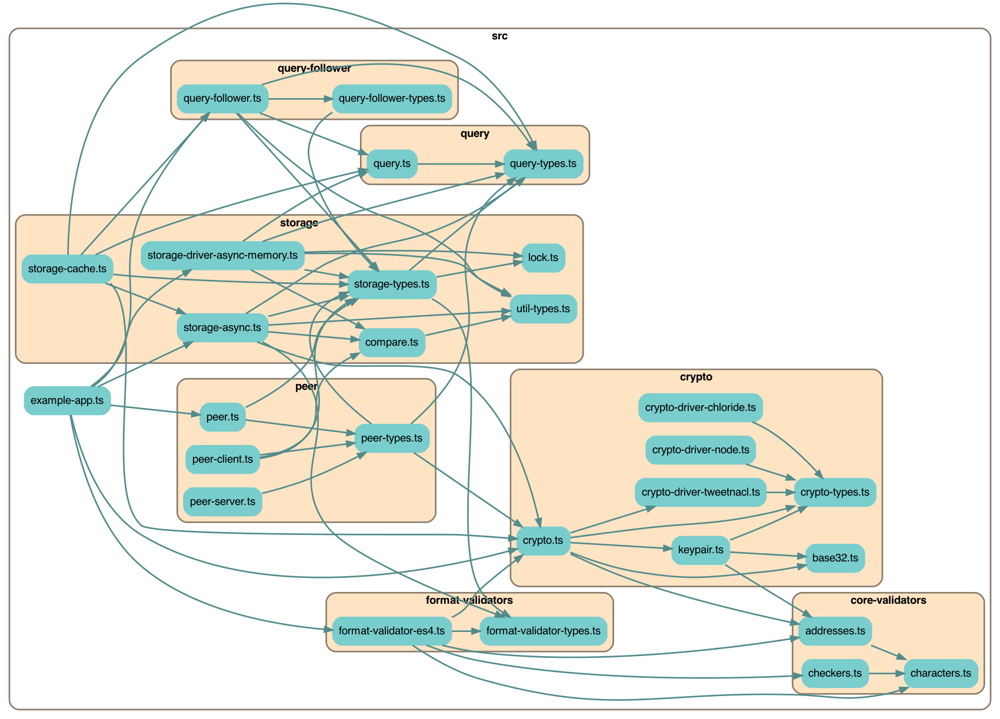

# Stone Soup

**WIP** April 2021

This is a reimplmenetation of [Earthstar](https://github.com/earthstar-project/earthstar), either an experiment or a fresh rewrite.

## Log control

Or with this global setting:

```ts
import {
    LogLevel,
    setDefaultLogLevel,
    setLogLevel
} from './util/log';

setDefaultLogLevel(LogLevel.None);  // set overall log amount
setLogLevel('main', LogLevel.Info);  // customize a certain part of the logs
```

The available levels are:
```ts
enum LogLevel {
    None = -1,
    Error = 0,  // default
    Warn = 1,
    Log = 2,
    Info = 3,
    Debug = 4,  // most verbose
};
```

⏳ Soon you will also be able to use this environment variable, but we're not sure how it will interact with the above settings.

```
EARTHSTAR_LOG_LEVEL=3 yarn start
```


## Multi-platform support

We aim to support:
* browser
* node 10, 12, 14, 16
* deno (⏳ eventually, not started yet)

### Buffers and Uint8Arrays

We use Uint8Arrays throughout the code to maximize platform support.  Some of the node-specific drivers use Buffers internally but the Buffers are converted to Uint8Arrays before leaving those drivers.

For convenience, variables that hold Uint8Arrays are called "bytes", like `bytesToHash` instead of `uint8ArrayToHash`.

`util/bytes.ts` has a bunch of helper code to do common operations on Uint8Arrays and to convert them back and forth to strings and to Buffers.

### Platform-specific drivers

There are two parts of stone-soup which are swappable to support different platforms or backends: `ICryptoDriver` and `IStorageDriverAsync`.  Everything else should work on all platforms.

Crypto drivers:
* `CryptoDriverChloride` -- only in browser
* `CryptoDriverNode` -- only in node 12+
* `CryptoDriverTweetnacl` -- universal

Storage drivers:
* `StorageDriverAsyncMemory` -- univeral
* `StorageDriverLocalStorage` -- browser (⏳ coming soon)
* `StorageDriverSqlite` -- node (⏳ coming soon)

Users of this library have to decide which of these drivers to import and use in their app.  Hopefully your app is using some build system that does tree-shaking and will discard the unused drivers.

### Platform-specific tests

The tests are split into folders:
* `test/universal/*.test.ts` -- tests that run everywhere
* `test/browser/*.test.ts` -- tests that only run in browsers
* `test/node/*.test.ts` -- tests that only run in node

And also
* `test/shared-test/code/*.shared.ts` -- collections of tests that are imported and run by the actual test files, mostly used to test drivers and invoked by the platform-specific tests

The platform-specific tests import these files to get access to the appropriate drivers:
* `test/browser/platform.browser.ts` -- exports an array of drivers that work in browsers
* `test/node/platform.node.ts` -- drivers that work in node
* `test/universal/platform.universal.ts` -- drivers that work everywhere

When we run tests in different platforms, we do this (except the `run-tests-somehow` command is actually different on each platform):

* In node: `run-tests-somehow build/test/universal/*.test.js build/test/node/*.test.js`
* In browser: `run-tests-somehow build/test/universal/*.test.js build/test/browser/*.test.js`

### To see an up-to-date list of drivers for different platforms

This data comes from `platform.*.ts`.

```sh
yarn print-platform-support
```

```
CRYPTO DRIVERS
  UNIVERSAL:
    CryptoDriverTweetnacl
  BROWSER ONLY:
    CryptoDriverChloride
  NODE ONLY:
    CryptoDriverNode

  BROWSER + UNIVERSAL:
    CryptoDriverChloride
    CryptoDriverTweetnacl
  NODE + UNIVERSAL:
    CryptoDriverNode
    CryptoDriverTweetnacl

STORAGE DRIVERS
  UNIVERSAL:
    StorageDriverAsyncMemory
  BROWSER ONLY:
  NODE ONLY:

  BROWSER + UNIVERSAL:
    StorageDriverAsyncMemory
  NODE + UNIVERSAL:
    StorageDriverAsyncMemory
```

### Building the library for multiple platforms

Currently we use `tsc` to build typescript from `/src/*` into javascript in `/build/*`.  This may change to esbuild in the future.

Right now everything is in a single package, `stone-soup`.

⏳ Soon we will have subpackages, and your app will do this:

```ts
// soon...
import { MostThings } from 'stone-soup';
import { NodeStuff } from 'stone-soup/node';
```

## Source code dependency chart

A --> B means "file A imports file B".

For readability this hides `/test/` and `/util/`.



And again with 3rd party dependencies as brown boxes with dotted lines:


Run `yarn depchart` to regenerate this.  You'll need graphviz installed.

## Splitting `IStorage` into `Storage` and `StorageDriver` classes

Think of this as `IStorageNiceAPIFullOfComplexity` and `IStorageSimpleLowLevelDriver`.

I want to make it easier to add new kinds of storage so I'm splitting IStorage into two parts:

The Storage does:
* the complex annoying stuff we only want to write once
* `set():` sign and add a document
* `ingest():` validate and accept a document from the outside
* followers and events
* user-friendly helper functions, getters, setters

The StorageDriver does:
* simple stuff, so we can make lots of drivers
* query for documents (this is actually pretty complicated)
* maintain indexes for querying (hopefully provided by the underlying storage technology)
* simple upsert of a document with no smartness

Possibly even you can have multiple Storages for one Driver, for example when you're using multiple tabs with indexedDb or localStorage.

## "Reliable indexing / streaming"

This shows an implementation of the "reliable indexing" idea discussed in [this issue](https://github.com/earthstar-project/earthstar/issues/66).

### The problem

We have livestreaming now, over the network and also to local subscribers, all based on `onWrite` events.

If you miss some events, you can't recover -- you have to do a full batch download of every document.

Events also don't tell you what was overwritten, which you might need to know to update a Layer or index.

### The solution: `localIndex`

Each Storage keeps track of the order that it receives documents, and assignes each doc a `localIndex` value which starts at 1 and increments from there with every newly written doc.

This puts the documents in a nice linear order that can be used to reliably stream, and resume streaming, from the Storage.

When we get a new version of a document, it gets a new `localIndex` and goes at the end of the sequence, and the old version vanishes, leaving a gap in the sequence.  It's ok that there are gaps.

The `localIndex` is particular to a certain IStorage.  It's kept in the `Doc` object but it's not really part of it; it's not included in the signature.  It's this IStorage's metadata about that document.

### Querying by localIndex

This lets you easily resume where you left off.  You can get batches of N docs at a time if you want, using the `limit` option.

```ts
storage.getDocsSinceLocalIndex(
    startAt: LocalIndex,
    limit?: number): Doc[];
```

(You can also still look up documents by path in the usual old way.)

### Followers: Reliable streaming locally, to subscribers or indexes

The old `onWrite` events are gone.  Now, there's now a new way to subscribe to a Storage: with a `Follower`.  A follower is like a pointer that moves along the sequence of documents, in order by `localIndex`, running a callback on each one.

This is a Kafka or Kappa-db style architecture.

You could use this to build an index or Layer that incrementally digests the content of an IStorage without ever missing anything, even if it only runs occasionally.  It just resumes from the last `localIndex` it saw, and proceeds from there.

There are 2 kinds of followers:

* Blocking followers must run before a write to the storage will complete.

* Lazy followers run async'ly.  Writing to a storage will wake up a lazy follower, but it might not start running for a little while, and it will catch up to the end at its own speed.

A follower has one callback (sync or async) that it runs on each doc in sequence.  It never allows that callback to overlap with itself, e.g. it waits to finish one doc before moving along to the next.  Both blocking and lazy followers work this way.  The difference between blocking and lazy is if the **IStorage** waits for them or not.

An IStorage may have many followers of both/either blocking and lazy types.

### Starting followers at the beginning or the end

You can start a Follower anywhere in the sequence: at the beginning (good for indexes and Layers), or at the current most recent document (good for live syncing new changes).

* Blocking followers hold up the entire IStorage until they catch up to the end

* Lazy followers just crawl along on their own.

### Reliable streaming over the network, when syncing

(Not implemented in this code yet)

When we send docs over the network we will send the `localIndex` to help the other side track where they are in our own sequence.  The other side will then discard the property and put their own `localIndex` on the document when they store it.

Peers will remember, for each other peer, which is the latest `localIndex` they've seen from that peer, so they can resume syncing from there.

This is similar to how append-only logs are synced in Scuttlebutt and Hyper, except our logs have gaps.

## More informative `onWrite` events

TODO: this is being moved into Followers.

## Slightly different querying

Querying has been made more organized -- see the Query type in `types.ts`.  It looks a bit more like an SQL query but the pieces are written in the order they actually happen, so it's easier to understand.

The order is:
* history (all or latest only)
* orderBy
* startAt (continue from a certain point)
* filter - the same options, timestamp, pathStartswith, etc etc
* limit

Also, the `cleanUpQuery` function is fancier and will also figure out if the query will match `all`, `some`, or `nothing` documents.  This helps with optimizations elsewhere.

## Problems left to solve

* Ephemeral documents disappear without leaving a trace, do we need events for that?
* An IStorage might significantly change or start over, by deleting most of its local documents and choosing a different sync query.  Then we'd need to tell subscribers and peers that we're effectively a different IStorage now.
  * localIndex could be a tuple `[generation, localIndex]` where generation is an integer that increments on each big change like that
  * or give each IStorage a UUID which gets randomly changed when big changes happen.  This would be helpful for other reasons too (to prevent echoing back documents to the storage that just gave them back to us, we need to track who gave them to us)
* Syncing by `localIndex` doesn't work very well when you also have a sync query, because you have to scan the entire sequence to find the couple of docs you care about.  We probably still want another way of efficient syncing that goes in path order and uses hashing in some clever way, sort of like a Merkle tree but not.

## Other small improvements

* The `Document` type is now named `Doc` to avoid collision with an existing built-in Typescript type

## Silly new vocabulary ideas

Very tentative idea to rename Earthstar to Stone Soup.

It's probably a bad idea to use cute names, but:

```
Earthstar       Stone Soup

Workspace       Soup?
Author          Chef?
Storage         Bowl, Pot, Cauldron, Crockpot, Saucepan
Document        Doc
Pub
Peer / Node     
```
