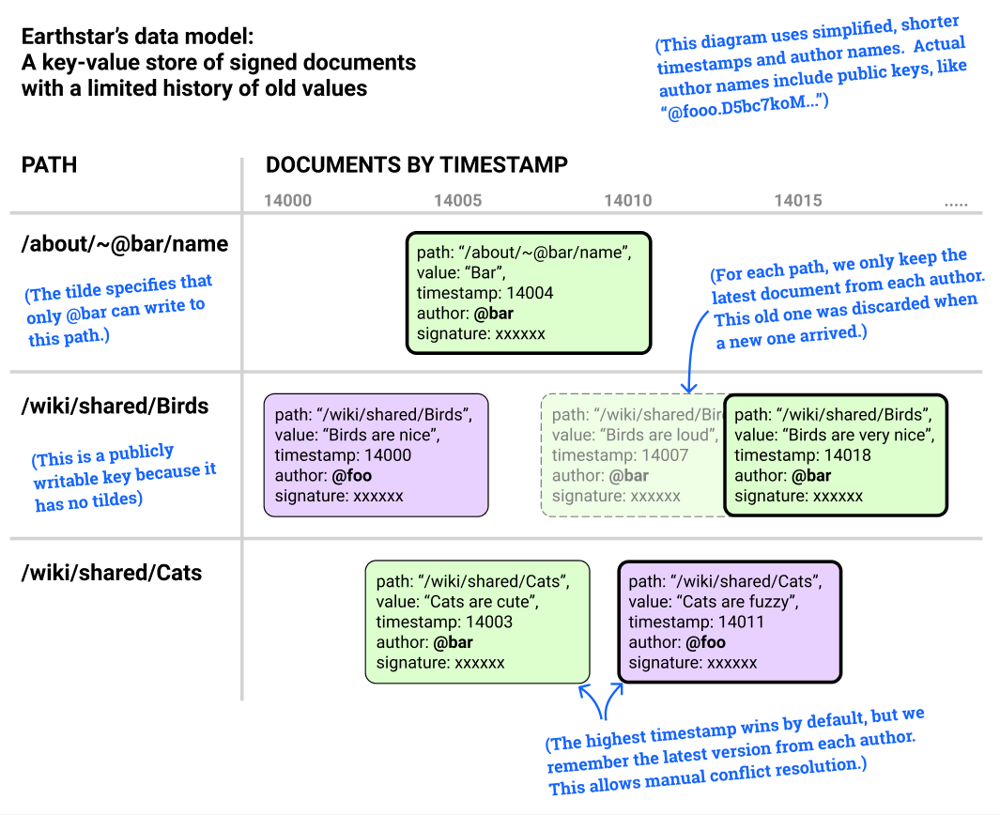
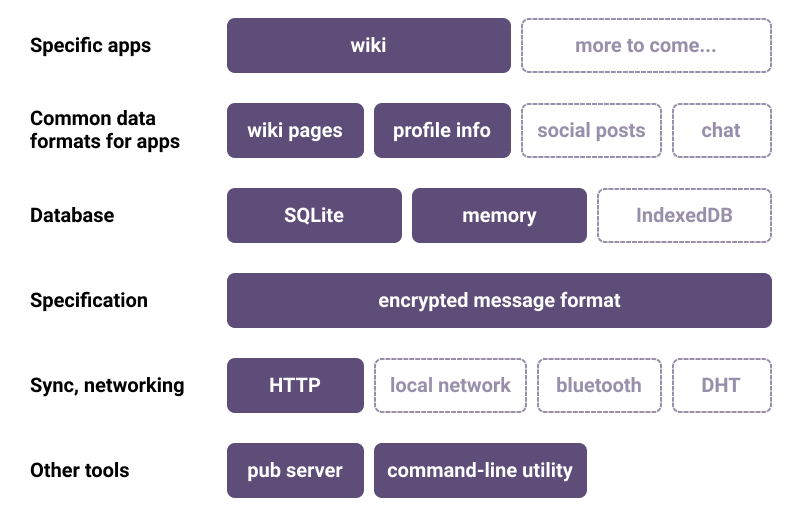
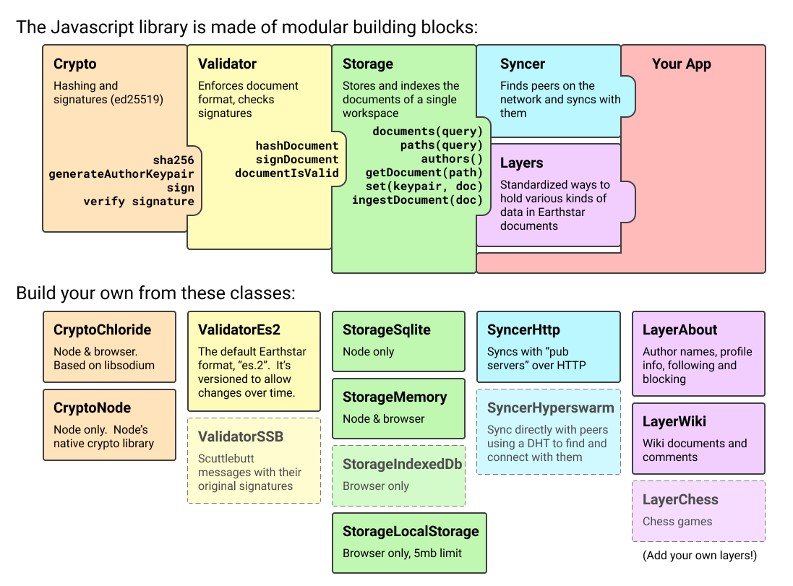

# Earthstar


## An offline-first, distributed, syncable, embedded document database for use in p2p software

*Alpha - do not use for important data yet*

Discuss Earthstar at [`#earthstar:matrix.org`](https://riot.im/app/#/room/!oGfoMKqZnBVrJYjebW:matrix.org?via=matrix.org)

Related tools:
* [earthstar-cli](https://github.com/cinnamon-bun/earthstar-cli) -- command line utility
* [earthstar-pub](https://github.com/cinnamon-bun/earthstar-pub) -- server to help you sync
* [earthstar-wiki](https://github.com/cinnamon-bun/earthstar-wiki) -- an example app built with Earthstar

Other docs:
* [Earthstar concepts and vocabulary](docs/vocabulary.md) -- more details about workspaces, etc

## What kinds of apps can you build with Earthstar?

Tools for collaborating with groups of people.  See [Use-cases](#Use-cases), below.

## Motivation

Centralized services like Facebook have lots of problems: privacy, surveillance, addiction, dark patterns, ads, "real name" policies that harm minority groups, poor handling of moderation, bots, ...

These problems come from 2 root causes:
* They have a **profit motive**, so their purpose is to extract value from users.
* They're **big**, so they're a bureaucracy that can't understand the nuances of the diverse world population they serve, and they're unresponsive to demands from their users.

We'd be better off with communication services that are:
* **Not for profit** - run by volunteers on small, cheap servers
* **Small** - close to their users, locally governed, more democratic, understanding local norms and culture

This is the "federated" model, like Mastodon: instead of one big Twitter, make a thousand small Twitters.

But this has problems too -- volunteer-run servers don't last forever, and when they shut down their users lose their communities.

Earthstar goes one step further: you can communicate without servers at all, directly from device to device; or you can run Earthstar on [servers ("called pubs")](https://github.com/cinnamon-bun/earthstar-pub) which help sync your data but have no authority over your account.  You can easily run your own servers for yourself and your friends.  Instructions coming soon.

All the authority in the system rests in the users and is enforced by cryptography, not central servers.  Since servers only exist to help with syncing, and your data and identity are independent of the servers, you can easily use as many or as few servers as you want, and move between them without losing anything.

Earthstar's philosophy is that **apps should be tools, not services**.  Authority no longer rests in a central server, it rests in each user.

## Data model

An Earthstar workspace holds mutable **documents** with unique **paths** (ids), similar to leveldb or CouchDb.

Within each **path**, we keep the newest version of that **document** from each author.  We discard old versions of a document from the same author.

In other words, it's a mapping from `(path, author)` to `latest version of the document at that path, from that author`.

The newest document (from any author) is considered the winner of a conflict.  More details below in the "Editing data" section.

There are no transactions.  The unit of atomic change is the document.



## Block diagram

Simplified diagram of the entire system.  The dashed boxes are not implemented yet.



A more detailed look at this Javascript implementation:



## Scope, typical usage

Each user will have their own instance of an Earthstar database, maybe in their browser or embedded in an Electron app.  There might also be some instances on cloud servers ("pubs").  The databases can sync with each other across HTTP or duplex stream connections.

Each database instance can hold a subset of the entire data, specified by a query such as "paths starting with a certain substring", "paths written after a certain timestamp", etc.

The universe of data is divided into **workspaces** -- collections of documents accessed by certain users.  Syncing happens one workspace at a time.

Read the [vocabulary and concepts](docs/vocabulary.md) documentation for more about workspaces.

## Editing data; multiple users and devices; conflicts

A single author can use multiple devices at the same time.  You "log into" a device by providing your public and private key, like a username and password.

Data is mutable.  Authors can update paths with new values.  The old data is thrown away and doesn't take up space.  You can also delete paths (soon); this replaces them with a tombstone value which is kept around.

There is a write permission system to allow only certain authors to write to certain paths.  Other paths can be written by anyone.

Soon, there will also be a way to write immutable messages, for use cases where you need those.

Conflicts from a single author (on multiple devices) are resolved by timestamp and the old data is discarded.  Conflicts from multiple authors are resolved by timestamp by default, but the old data is kept to allow for manual conflict resolution if needed.

## Security properties

Each author is identified by a public key.

Data updates are signed by the author, so it's safe for untrusted peers to help host and propagate data.  (Soon) you will also be able to encrypt data so untrusted peers can host it without reading it.

Malicious peers can:
* Withold updates to individual documents during a sync
* See the data (until encryption is implemented, soon)
* Know which peers they're connecting to

Malicious peers cannot:
* Alter documents from another author
* Forge new documents signed by another author

Although malicious peers can withold individual documents, as long as there are honest peers around you will eventually get the latest verison of everything.

Because it allows partial sync and mutation of data, Earthstar doesn't cryptographically guarantee that you have a complete dataset with no gaps from a certain author.  Authors could chose to use sequential paths or embed a blockchain of hash backlinks into their messages, and you could verify these in your app (outside of Earthstar).

## Comparisons

Like leveldb, but:
* multi-author
* it syncs

Like CouchDb, but:
* with signatures and encryption, so untrusted nodes can help move data around.

Like Scuttlebutt, but:
* one author can use multiple devices
* data is mutable
* instead of an append-only log, it's a set of mutable items
* supports partial replication
* will sync over HTTP, not just TCP, so it's easy to host in places like Glitch.com
* has less strict data guarantees -- you can't tell if you have someone's entire dataset or not

Like DAT, but:
* multi-author, multi-device
* simpler

Like IPFS, but:
* multi-author, multi-device
* mutable

Like Firebase, but:
* open source
* distributed

Sometimes immutability is needed, like if you're running a package registry or want an audit log.  For social-network style use cases, though, immutability can be a privacy liability instead of a desirable guarantee.

## Use cases

Earthstar can be used for invite-only tools where you have all the data (think Slack) and large open-world tools where you only replicate part of the entire dataset (think SSB).  Apps tell Earthstar what paths and what authors to replicate.

These styles of app could be built on top of Earthstar:
* wikis
* chat: Slack, IRC
* social: Facebook, Scuttlebutt, Discourse, LiveJournal, Forums
* microblogging: Twitter, Mastodon
* productivity: Trello, GitHub Issues, Asana, Todo lists
* office: Google sheets
* art: Collaborative drawing or music tools, multi-user Twine for making interactive fiction games

## What doesn't it do?

Earthstar doesn't handle multi-user text editing like Google Docs.  This is a different challenge.  You could probably use a CRDT like Automerge and rely on Earthstar to move and sync the patches it produces.

It will eventually stream live changes, but it's not designed for low-latency live data.

The cryptography is not audited yet.

Earthstar is not focused on anonymity -- more on autonomy.  You could use it over Tor or something.

Earthstar doesn't provide transactions or causality guarantees.

Moderation and blocking support is not built in, but apps can build it on top of Earthstar.

## Example

The main interface to Earthstar is the Storage class:

```ts
// A Store is all about a single workspace.
// Workspaces are separate universes of data
// that don't sync with each other.
// You also choose which feed formats you want to support
// by supplying validators (one for each format).
constructor(validators : IValidator[], workspace : string)

// onChange is called whenever any data changes.
// it doesn't yet send any details about the changes.
// subscribe with onChange.subscribe(...cb...);
onChange: Emitter<undefined>;

// look up a path and get the corresponding value...
getValue(path: string): string | undefined;
// or get the whole document, which is an object with more details (author, timestamp...)
getDocument(path: string): Document | undefined;

// query with a variety of options - filter by paths and authors, etc
documents(query?: QueryOpts): Document[];
paths(query?: QueryOpts): string[];
values(query?: QueryOpts): string[];

// list all authors who have written
authors(): EncodedKey[];

// write a document to the database, which will be signed by your author key.
set(keypair: Keypair, docToSet: DocToSet): boolean;

// try to import an doc from another Store.
ingestDocument(doc: Document): boolean;

// basic sync algorithm.  a faster one will be made later.
sync(otherStore: IStorage, opts?: SyncOpts): SyncResults;
```

Usage example:
```ts
const { StorageMemory, ValidatorEs3, generateAuthorKeypair } = require('earthstar');

// Create a database for a particular workspace, '+gardening.xxxxxxxx'
// We've chosen to use the latest 'es.3' feed format so we supply the matching validator.
let storage = new StorageMemory([ValidatorEs3], '+gardening.xxxxxxxx');

// Make up some authors for testing.
// A keypair is { address: '@aaaa.xxx', secret: 'xxx' }.
// (xxx represents base58-encoded ed25519 keys)
let keypair1 = generateAuthorKeypair('aaaa');
let keypair2 = generateAuthorKeypair('bbbb');
let author1 = keypair1.address;
let author2 = keypair2.address;

// It's a key-value store.
storage.set(keypair1, { format: 'es.3', path: '/wiki/Strawberry', value: 'Tasty' });
storage.getValue('/wiki/Strawberry'); // --> 'Tasty'

// One author can use multiple devices with no problems.
// Conflicts are resolved by timestamp.
// Here the same author overwrites their previous value,
// which is forgotten from the database.
storage.set(keypair1, { format: 'es.3', path: '/wiki/Strawberry', value: 'Tasty!!' });
storage.getValue('wiki/Strawberry'); // --> 'Tasty!!'

// Multiple authors can overwrite each other (also by timestamp).
storage.set(keypair2, { format: 'es.3', path: '/wiki/Strawberry', value: 'Yum' });
storage.getValue('wiki/Strawberry'); // --> 'Yum'

// We keep the one most recent value from each author, in case
// you need to do better conflict resolution later.
// To see the old values, use a query:
storage.values({ path: 'wiki/Strawberry', includeHistory: true });
// --> ['Yum', 'Tasty!!']  // newest first

// Get more context about a document, besides just the value.
storage.getDocument('wiki/Strawberry');
/* --> {
    format: 'es.3',
    workspace: '+gardening.xxxxxxxx',
    path: 'wiki/Strawberry',
    value: 'Yum',
    author: '@aaaa.xxx',
    timestamp: 1503982037239,  // in microseconds: Date.now()*1000
    signature: 'xxxxxxxx.sig.ed25519',
} */

// WRITE PERMISSIONS
//
// Paths can specify which authors are allowed to write to them.
// Author names that occur prefixed by '~' in a path can write to that path.
//
// Examples:
// (in these docs, "xxx" is shorthand for a long public key)
// One author write permission:
//   '/about/~@aaaa.xxx/name'  -- only @aaaa.xxx can write here.
//   '/about/~@aaaa.xxx/follows/@bbbb.xxx'  -- only @aaaa.xxx can write here
// Public:
//   '/wall/@aaaa.xxx'  -- no tilde, so anyone can write here
//   '/wiki/Kittens'  -- no tilde, so anyone can write here
// Multiple authors:
//   '/whiteboard/~@aaaa.xxx~@bbbb.xxx'  -- both @aaaa.xxx and @bbbb.xxx can write here
//
// Here we'll set the author's display name
storage.set(keypair1, {
    format: 'es.3',
    path: '/about/~' + keypair1.address + '/name',
    value: 'Suzie',
});

// You can do leveldb style queries.
storage.paths()
storage.paths({ lowPath: '/abc', limit: 100 })
storage.paths({ pathPrefix: '/wiki/' })

// You can sync to another Storage with the same workspace address
let storage2 = new StorageMemory([ValidatorEs3], '+gardening.xxxxxxxx');
storage.sync(storage2);
// Now storage and storage2 are identical.

// Get notified when anything changes.
let unsub = storage.onChange.subscribe(() => console.log('something changed'));

// Later, you can turn off your subscription
unsub();
```
----
## Details and notes

### Signatures
Document hashes are used within signatures and to link to specific versions of a doc.

There's a simple canonical way to hash a doc: mostly you just concat all the fields in a predefined order:
```
    sha256([
        doc.schema,
        doc.workspace,
        doc.path,
        sha256(doc.value),
        '' + doc.timestamp,
        doc.author,
    ].join('\n')).hexDigest();
```
None of those fields are allowed to contain newlines (except value, which is hashed for that reason) so newlines are safe to use as a delimiter.

To sign a doc, you sign its hash with the author's secret key.

Note that docs only ever have to get transformed INTO this representation just before hashing -- we never need to convert from this representation BACK into a real doc.

There is no canonical "feed encoding" - only the canonical way to hash an doc, above.  Databases and network code can represent the doc in any way they want.

The hash and signature specification may change as the schema evolves beyond `es.3`.  For example there may be another schema `ssb.1` which wraps and embeds SSB messages and knows how to validate their signatures.


### Sync over duplex streams:
Here's a very simple but inefficient algorithm to start with:
```
    sort paths by (path, timestamp DESC, signature ASC)
    filter by my interest query
    while true:
        both sides send next 100 docs to each other as (path, timestamp, signature)
        both sides figure out what the other needs and send it in full
        both sides send 'ok'
```

### Sync over HTTP when only one peer is publicly available:
Here's a very simple but inefficient algorithm to start with:
```
    the client side is in charge and does these actions:
    sort paths by (path, timestamp DESC, signature ASC)
    filter by my interest query
    GET /interest-query   the server's interest query
    while true:
        GET /doc-versions?after='foo/bar'&limit=100 from server
        compare with my own docs
        pull things I need
            POST /batch-get-docs       paths=[foo, foo/a, foo/b, ...]
        push things they need:
            POST /batch-ingest-docs    docs=[ {...}, {...} ]
```

Note that everything happens in batches instead of infinite streams.  The code avoids using streams.

For *efficient* sync, we'll use something similar to [this set reconciliation algorithm described by Aljoscha Meyer](https://github.com/AljoschaMeyer/set-reconciliation/).

### HTTP API

This is out of date -- See earthstar-pub for the latest

```
HTTP replication:

GET /interest-query   the server's interest query
    return a list of query objects -- what does the server want?
GET /doc-versions [after='...'] [limit=100] [before='...']
    return array of docs with just path, version, first N bytes of signature
POST /batch-get-docs       paths=[foo, foo/a, foo/b, ...]
    return complete docs
POST /batch-ingest-docs    docs=[ {...}, {...} ]
    ask server to write these docs
    return 'ok' or error
```

## Future plans

### Immutable documents by putting "(hash)" in the path
You'll be able to put the literal string "`(hash)`" in a path.  It will be replaced with the hash of that document.  Since no other document can have the same path, it will be impossible to overwrite or delete this document, making it immutable.

* Signatures are based on the shorthand path
* Upon ingestion to the db, replace `(hash)` with the actual hash of the document
* Database lookups use the full expanded path
* Across the network, we only need to send the shorthand path.  The expanded path is derived state.
* `(hash)` lets you create docs that can never be overwritten, because you can never make another doc with the same hash.
* The expanded path needs to contain a character that's not allowed in regular paths, so the only way to get that path is via `(hash)`.  e.g. a percent sign like `(hash)` --> `%a93jDj39sdH...`

### Path overlays
* It would be easy make an overlay view of different path prefixes ("folders") within a Storage
* Or overlay two Storage instances
* For example you could combine `/wiki/~@a.xxxx` and `/wiki/~@b.xxxx` into one namespace
