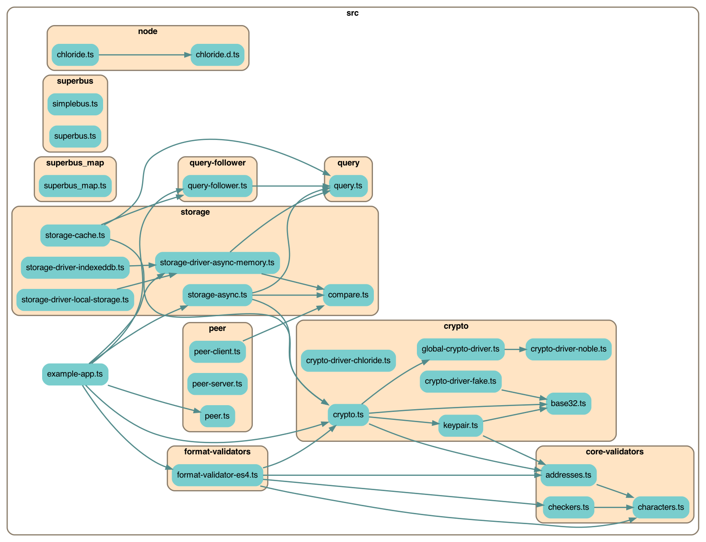
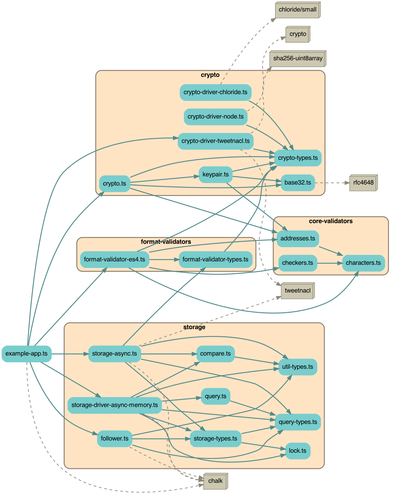

# Earthstar

Sync stuff you care about with people you know. A specification and Javascript
library for building online tools you can truly call your own.Build
offline-first, decentralised, and private network applications in the browser,
server, or command-line.

**Clearly there's a lot to unpack, so check out
[Earthstar's website](https://earthstar-project.org) for an introduction to
Earthstar's concepts, an API tour, technical documentation, videos, and more!**

## Usage

To use in Deno, add the following:

```ts
import * as Earthstar from "https://deno.land/x/earthstar/mod.ts";
```

To use with Node or apps built with NPM dependencies:

```
npm i earthstar
```

And then import in your code:

```ts
import * as Earthstar from "earthstar";
```

## Development

### Setup

You will need Deno installed.
[Instructions for installation can be found here](https://deno.land/#installation).
You may also want type-checking and linting from Deno for your IDE, which you
can get with extensions
[like this one for VSCode](https://deno.land/manual@v1.17.2/vscode_deno).

To check that you've got everything set up correctly:

`make example`

This will run the example script at `example-app.ts`, and you will see a lot of
colourful log messages from the app.

### Scripts

Scripts are run with the `make` command.

- `make test` - Run all tests
- `make test-watch` - Run all tests in watch mode
- `make fmt` - Format all code in the codebase
- `make npm` - Create a NPM package in `npm` and run tests against it (requires
  Node v14 or v16 to be installed).
- `make bundle` - Create a bundled browser script at `earthstar.bundle.js`
- `make depchart` - Regenerate the dependency chart images
- `make coverage` - Generate code test coverage statistics
- `make clean` - Delete generated files

### Orientation

- The entry for the package can be found at `mod.ts`.
- Most external dependencies can be found in `deps.ts`. All other files import
  external dependencies from this file.
- Script definitions can be found in `Makefile`.
- Tests are all in `src/test/`
- The script for building the NPM package can be found in `scripts/build_npm.ts`

### Uint8Arrays and Buffers

We use Uint8Arrays throughout the code to maximize platform support. Some of the
node-specific drivers use Buffers internally but the Buffers are converted to
Uint8Arrays before leaving those drivers.

For convenience, variables that hold Uint8Arrays are called "bytes", like
`bytesToHash` instead of `uint8ArrayToHash`.

`util/bytes.ts` has a bunch of helper code to do common operations on
Uint8Arrays and to convert them back and forth to strings and to Buffers.

### Platform-specific tests

Drivers are tested against the runtimes they're intended for. When tests are
run, they pull the correct scenarios from 'src/test/test-scenarios.ts', where
the current runtime is inferred during runtime.

### Classes

The `Replica` is the main star of the show. Classes to the right are used
internally for its implementation. Classes to the left stack on top of an
`Replica` to do extra things to it (subscribe to changes, cache data, etc).

Each `Replica` holds the Docs for one Share.


Names starting with `I` are interfaces; there are one or multiple actual classes
that implement those interfaces.

The orange classes are "drivers" which have multiple implementations to choose
from, for different platforms (node, browser, etc).

Blue arrows show which functions call each other.

Thick black arrows show which classes have pointers to other classes when
they're running.

### Source code dependency chart

A --> B means "file A imports file B".

For readability this hides `/test/` and `/util/` and `*-types.ts`.



And again with 3rd party dependencies as brown boxes with dotted lines, and
including `*-types.ts`



Run `yarn depchart` to regenerate this. You'll need graphviz installed.

### Platform-specific drivers

There are two parts of stone-soup which are swappable to support different
platforms or backends: `IReplica` and `IReplicaDriver`. Everything else should
work on all platforms.

Crypto drivers:

- `ReplicaDriverChloride` - only in browser, Node
- `ReplicaDriverNode` - only in Node
- `ReplicaDriverNoble` - universal

Storage drivers:

- `ReplicaDriverMemory` - univeral
- `ReplicaDriverLocalStorage` - browser
- `ReplicaDriverIndexedDB` - browser
- `ReplicaDriverSqlite` - Node, Deno

Users of this library have to decide which of these drivers to import and use in
their app.

### Documentation

We use JSDoc for user documentation. You can view docs for the whole codebase at
https://doc.deno.land/https://deno.land/x/stone_soup@v8.0.0/mod.ts, or by
running the following from the root of the project:

```
deno doc mod.ts
```

JSDocs are intended for end-users of the library. Comments for contributors
working with the codebase — e.g. notes on how something is implemented — are
better as standard JS comments.

If possible, use a single line for the JSDoc. Example:

```ts
/** Does something great */
export function doSomething() {
  // ...
}
```

You can use markdown inside of JSDoc block. While markdown supports HTML tags,
it is forbidden in JSDoc blocks.

Code string literals should be braced with the back-tick (\`) instead of quotes.
For example:

```ts
/** Import something from the `earthstar` module. */
```

It's not necessary to document function arguments unless an extra explanation is
warranted. Therefore `@param` should generally not be used. If `@param` is used,
it should not include the `type` as TypeScript is already strongly typed.

```ts
/**
 * Function with non obvious param.
 * @param nonObvious Description of non obvious parameter.
 */
```

Code examples should utilize markdown format, like so:

````ts
/** A straight forward comment and an example:
 * ```ts
 * import { Crypto } from "stone-soup";
 * const keypair = Crypto.generateAuthorKeypair("suzy");
 * ```
 */
````

Code examples should not contain additional comments and must not be indented.
It is already inside a comment. If it needs further comments it is not a good
example.

Exported functions should use the `function` keyword, and not be defined as
inline functions assigned to variables. The main reason for this being that they
are then correctly categorised as functions.

### Publishing to NPM

1. Run `make VERSION="version.number.here" npm`, where `version.number.here` is
   the desired version number for the package.
2. `cd npm`
3. `npm publish`

## Changes from Earthstar v1

### Splitting `Storage` into `Replica` and `ReplicaDriver` classes

Think of this as `IStorageNiceAPIFullOfComplexity` and
`IStorageSimpleLowLevelDriver`.

I want to make it easier to add new kinds of storage so I'm splitting IStorage
into two parts:

The Storage does:

- the complex annoying stuff we only want to write once
- `set():` sign and add a document
- `ingest():` validate and accept a document from the outside
- user-friendly helper functions, getters, setters
- an event bus that other things can subscribe to, like QueryFollowers

The StorageDriver does:

- simple stuff, so we can make lots of drivers
- query for documents (this is actually pretty complicated)
- maintain indexes for querying (hopefully provided by the underlying storage
  technology)
- simple upsert of a document with no smartness

Possibly even you can have multiple Storages for one Driver, for example when
you're using multiple tabs with indexedDb or localStorage.

### "Reliable indexing / streaming"

This shows an implementation of the "reliable indexing" idea discussed in
[this issue](https://github.com/earthstar-project/earthstar/issues/66).

#### The problem

We have livestreaming now, over the network and also to local subscribers, all
based on `onWrite` events.

If you miss some events, you can't recover -- you have to do a full batch
download of every document.

Events also don't tell you what was overwritten, which you might need to know to
update a Layer or index.

#### The solution: `localIndex`

Each Storage keeps track of the order that it receives documents, and assignes
each doc a `localIndex` value which starts at 1 and increments from there with
every newly written doc.

This puts the documents in a nice stable linear order that can be used to
reliably stream, and resume streaming, from the Storage.

When we get a new version of a document, it gets a new `localIndex` and goes at
the end of the sequence, and the old version vanishes, leaving a gap in the
sequence. It's ok that there are gaps.

The `localIndex` is particular to a certain IStorage. It's kept in the `Doc`
object but it's not really part of it; it's not included in the signature. It's
this IStorage's metadata about that document. When syncing, it's sent as one of
the "extra fields"
[(newly added to the specification)](https://earthstar-docs.netlify.app/docs/reference/earthstar-specification/#extra-fields-for-syncing),
observed by the receiving peer, then discarded and overwritten with the
receiving peer's own latest `localIndex` number.

#### Use cases

1. Streaming sync between peers, which can be interrupted and resumed
1. Layers and indexes that use a QueryFollower to subscribe to changes in a
   Storage. These might store their indexes in localStorage, for example, and
   would therefore want to resume indexing instead of starting over from
   scratch.
1. React components that need to know when to re-render

For use cases where the listener will never have any downtime, they don't really
need to be able to resume, they can just listen for events from the Storage
instead and it may be more efficient. For example a React component could listen
for events about a particular document instead of making a whole QueryFollower
that has to go through every single change to find changes to that particular
document.

#### Properties of the `localIndex` sequence

The docs, sorted by `localIndex` on a particular peer, have these properties:

**Properties**

1. The docs are in a stable order that does not change, except:
1. Newly added or changed docs go at the end, increasing the highest
   `localIndex` by 1.
1. When a doc is updated (same author and same path, but newer timestamp), we
   discard the old version. So we leave a gap in the sequence where the old
   verison used to be, and the new version goes on the end of the sequence.
1. The first doc has a `localIndex` of zero, unless it was later changed, in
   which case there will be a gap at zero.

Why do all this? The goal is to be able to catch up to changes since the last
time we looked at a Storage. We can do that by remembering the highest
`localIndex` we saw last time, and now getting all the docs later than that in
the sequence. We always read this sequence from old to new (in increasing order
of `localIndex`.

There are not really any other nice properties about this sequence:

**Downsides**

1. The `localIndex` order is not sorted by `path`, `timestamp`, `author`, or any
   other useful property. The order is jumbled because docs can be received in
   any order during a sync, perhaps with multiple other peers simultaneously,
   perhaps some using Sync Filters to only get some docs...
1. The order is different on every peer (that's why it's "local").
1. The history docs for a certain path will be in a jumbled order in the
   `localIndex` sequence. The Latest doc for a path can be before or after the
   other history docs. User of QueryFollowers will need some bookeeping to
   remember which version is the Latest for each path, if they care (e.g. if
   it's being used as an index and not just a sync mechanism between peers).
1. When a doc is modified and the old one is deleted, leaving a gap, you do not
   get notified about the gap. There is no pointer back to the gap, or anything.
   Users of QueryFollowers are expected to have some kind of index so they can
   notice that the new doc overwrites the old one, and delete the old one.
1. When an ephemeral doc expires, it leaves a gap in the sequence but nothing is
   added to the end of the sequence. Users of QueryFollowers are expected to pay
   attention to expiration dates and delete ephemeral docs themselves. We may
   also add an event on the Storage when a doc expires, but you could miss this
   event if you were not listening at that moment, so you'll still have to check
   for your own expired docs from time to time.
1. QueryFollowers should always progress in the direction of increasing
   `localIndex`. (They can start at 0, or the latest number, or anywhere in
   between). This makes it simple to keep track of where to resume next time.
   However this means we always process the oldest-received docs first, but the
   user probably cares more about the recently-received docs.
   - It would be possible with fancier bookeeping to make QueryFollowers that
     track which intervals of the sequence they've visited, so they can work
     from newest-to-oldest. But sometimes the oldest-received docs are the most
     important (like usernames)...

#### Querying by `localIndex`

This lets you easily resume where you left off. You can get batches of N docs at
a time if you want, using the `limit` option.

```ts
storage.getDocsSinceLocalIndex(
    startAt: LocalIndex,
    limit?: number): Doc[];
```

This is also how you tell a QueryFollower where to start in the sequence.
QueryFollowers ignore the `limit` property though.

(You can also still look up documents by path in the usual old way.)

### Reliable streaming over the network, when syncing

(Not implemented in this code yet)

When we send docs over the network we will send the `localIndex` to help the
other side track where they are in our own sequence. The other side will then
discard the property and put their own `localIndex` on the document when they
store it.

Peers will remember, for each other peer, which is the latest `localIndex`
they've seen from that peer, so they can resume syncing from there.

This is similar to how append-only logs are synced in Scuttlebutt and Hyper,
except our logs have gaps.

### Slightly different querying

Querying has been made more organized -- see the Query type in `types.ts`. It
looks a bit more like an SQL query but the pieces are written in the order they
actually happen, so it's easier to understand.

The order is:

- history (all or latest only)
- orderBy
- startAt (continue from a certain point)
- filter - the same options, timestamp, pathStartswith, etc etc
- limit

Also, the `cleanUpQuery` function is fancier and will also figure out if the
query will match `all`, `some`, or `nothing` documents. This helps with
optimizations elsewhere.

## Problems left to solve

- Ephemeral documents disappear without leaving a trace, do we need events for
  that?
- An IStorage might significantly change or start over, by deleting most of its
  local documents and choosing a different sync query. Then we'd need to tell
  subscribers and peers that we're effectively a different IStorage now.
  - localIndex could be a tuple `[generation, localIndex]` where generation is
    an integer that increments on each big change like that
  - or give each IStorage a UUID which gets randomly changed when big changes
    happen. This would be helpful for other reasons too (to prevent echoing back
    documents to the storage that just gave them back to us, we need to track
    who gave them to us)
- Syncing by `localIndex` doesn't work very well when you also have a sync
  query, because you have to scan the entire sequence to find the couple of docs
  you care about. We probably still want another way of efficient syncing that
  goes in path order and uses hashing in some clever way, sort of like a Merkle
  tree but not.

## Other small improvements

- The `Document` type is now named `Doc` to avoid collision with an existing
  built-in Typescript type
