# A Guided Tour of Earthstar

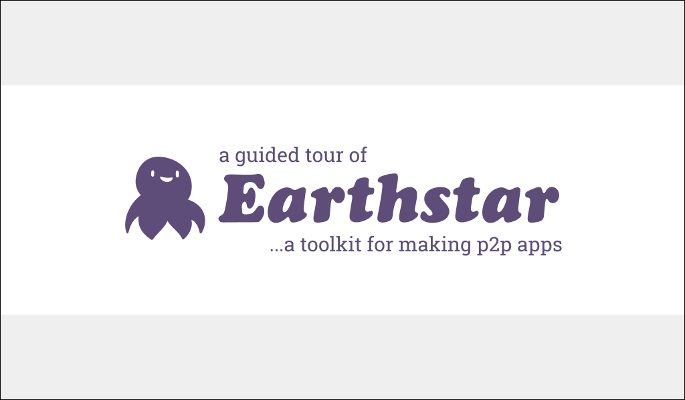

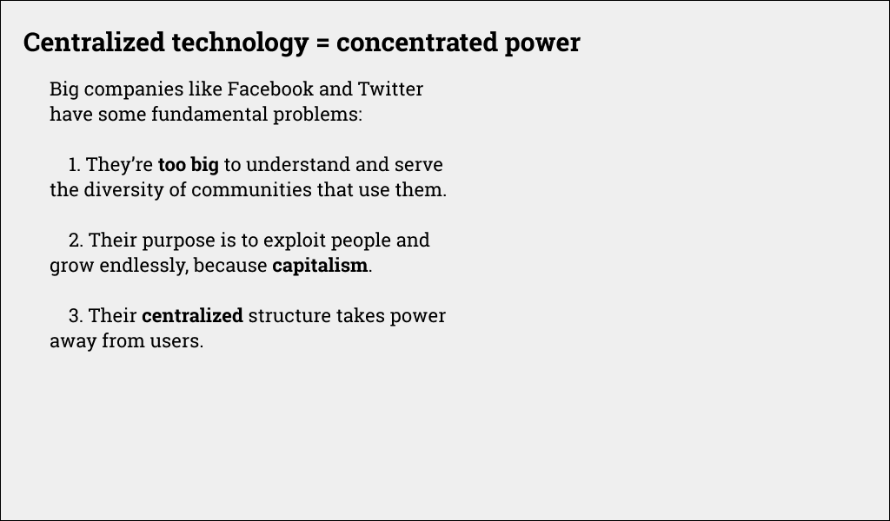

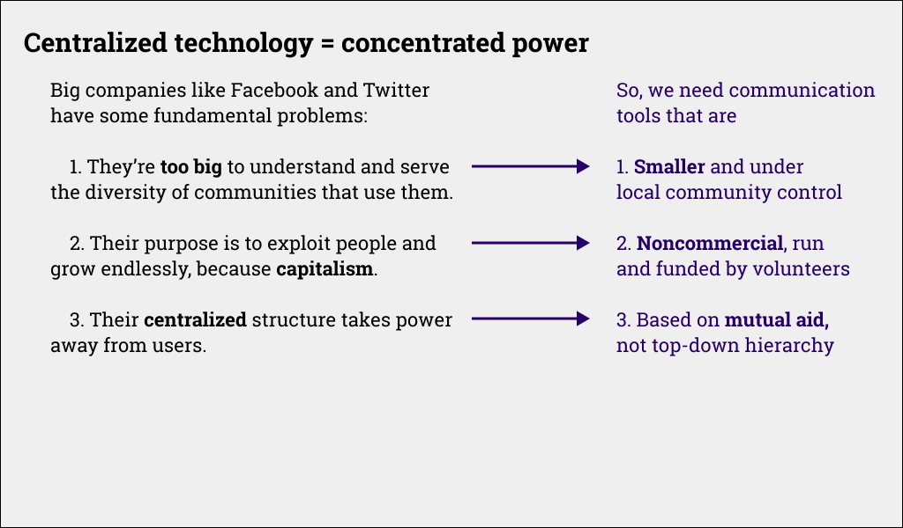

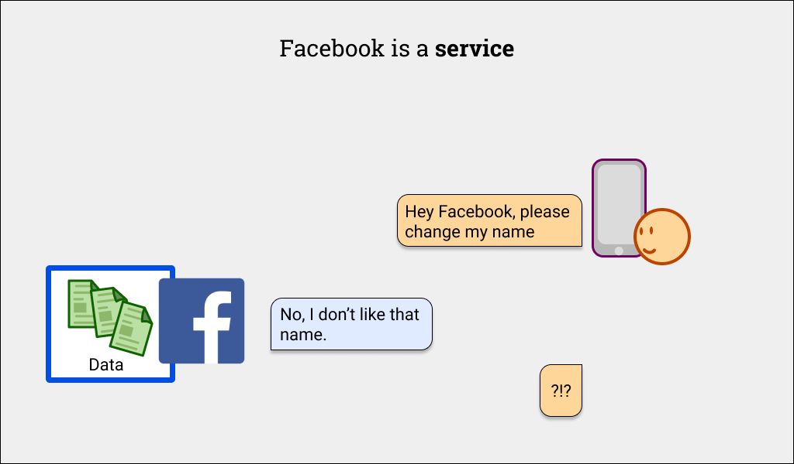

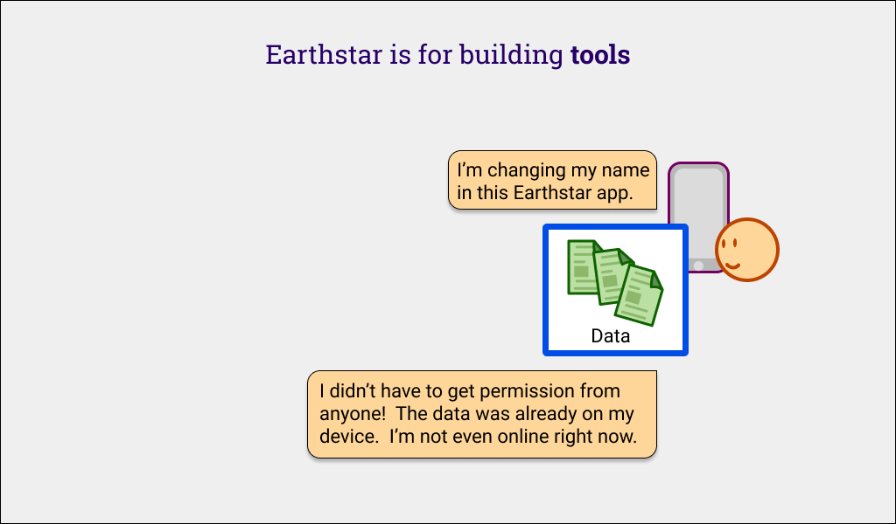

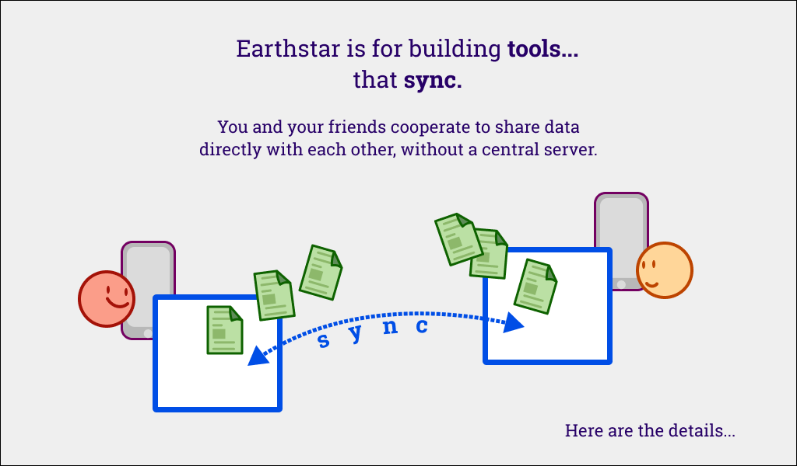

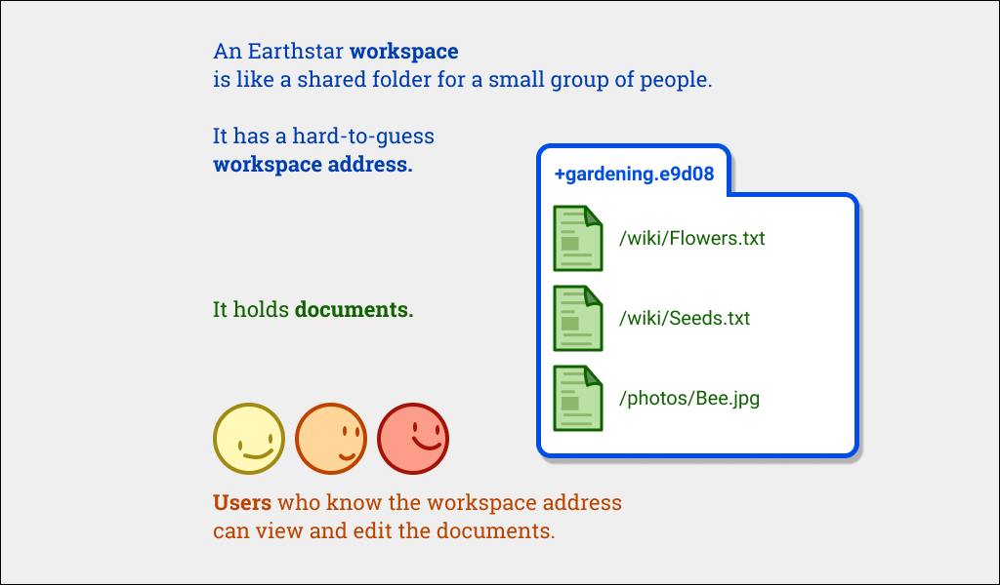

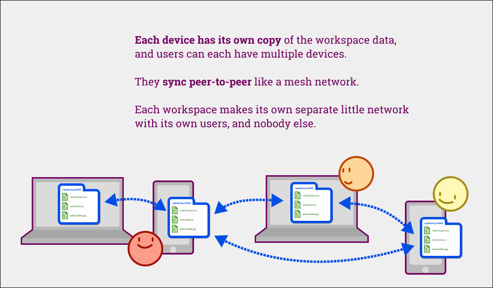

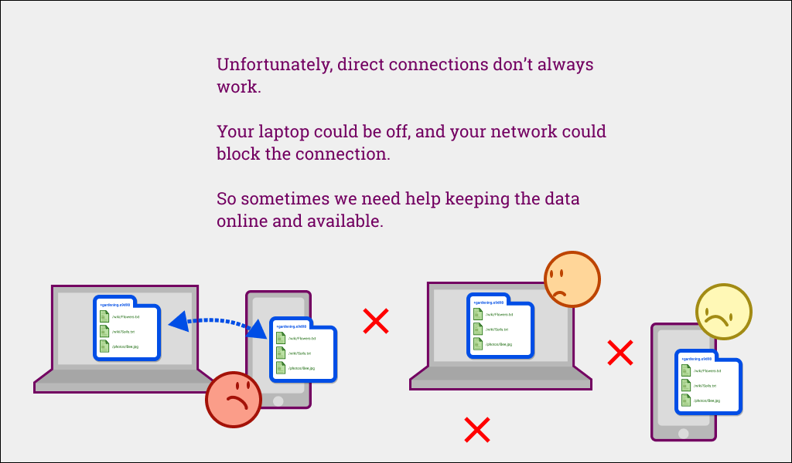

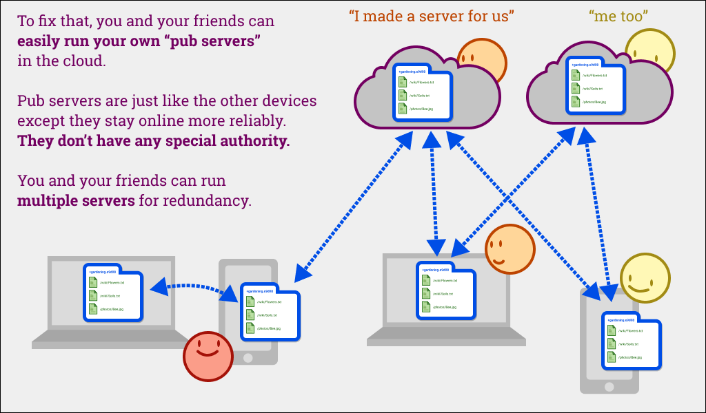

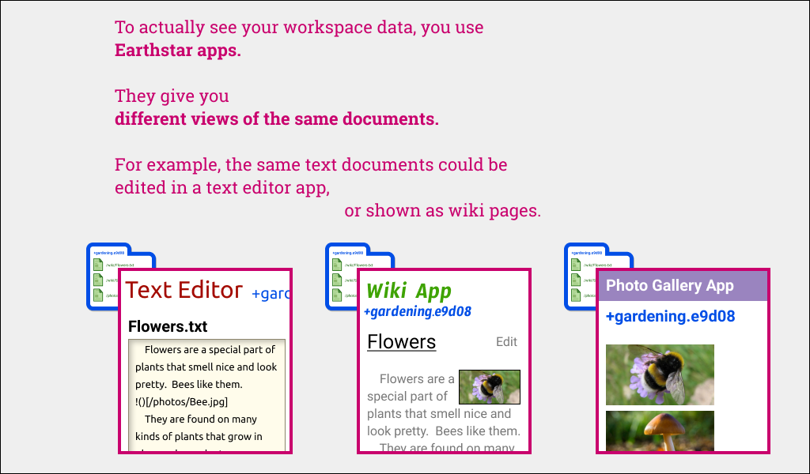

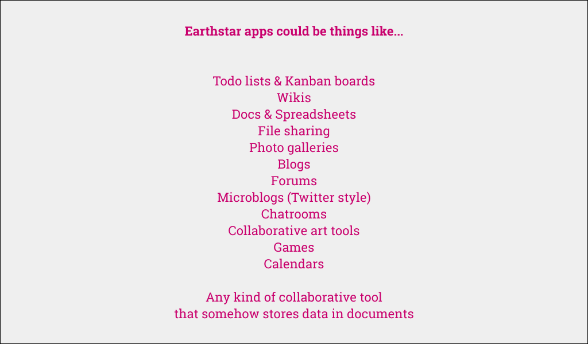

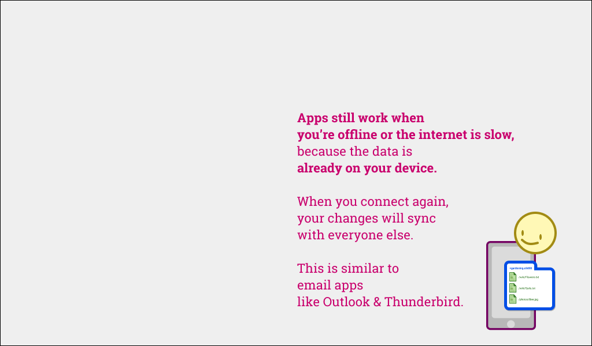

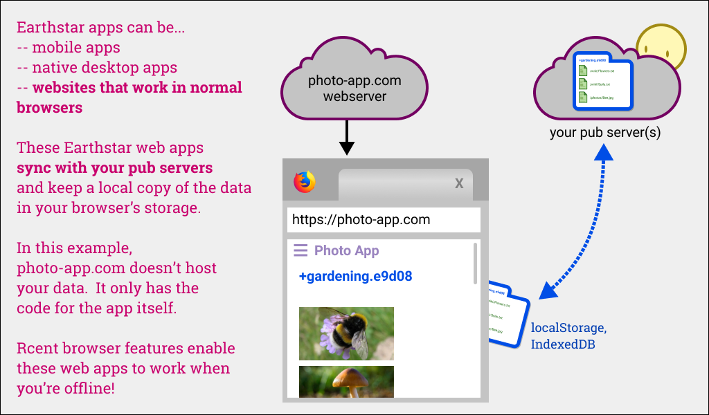

## TODO: add slides about

* how user identities & names work
* documents can be writable by anyone, or owned by just one person
* data can be edited & deleted
* syncing is flexible - you can do a partial sync to quickly get the data you care about
* data is signed to prevent tampering as it travels through the network
